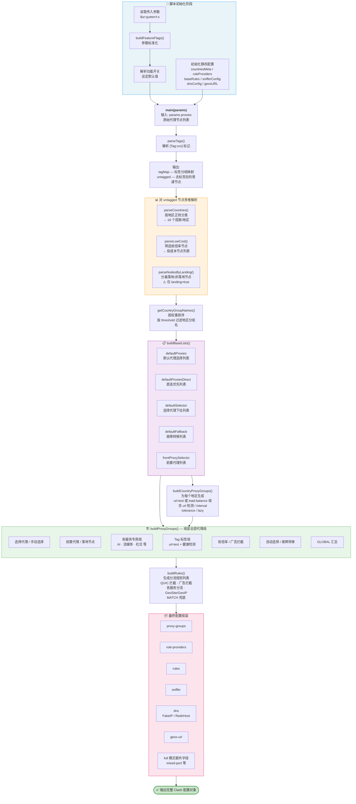
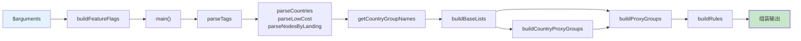

# Substore 订阅转换覆写脚本

> powerfullz 的 Substore 订阅转换脚本，用于将代理订阅源转换为 Clash（mihomo）内核可用的完整配置。

## 功能概述

本脚本作为 Sub-Store 的覆写模块运行，接收原始代理订阅数据，对节点进行分类、分组，并自动生成完整的 Clash 配置（包括代理组、分流规则、DNS 配置等）。

### 核心能力

| 功能 | 说明 |
|------|------|
| **节点地区分组** | 按正则匹配将节点分类到 16 个国家/地区（香港、台湾、美国等），支持权重排序 |
| **Tag 标签分组** | 识别节点名称中的 `[Tag:xxx]` 标记，自动创建自定义标签代理组 |
| **低倍率节点** | 自动筛出 `0.x 倍率`、`省流`、`实验性` 等低成本节点单独分组 |
| **落地节点** | 识别家宽/商宽/星链等落地类节点，支持前置代理链路 |
| **负载均衡** | 地区组可在 `url-test`（自动选择最低延迟）和 `load-balance`（负载均衡）间切换 |
| **正则过滤模式** | 可选使用 `include-all + filter` 替代直接枚举节点名，适用于节点名不固定的场景 |
| **分流规则** | 内置 30+ 条分流规则，覆盖广告拦截、AI 服务、流媒体、社交、加密货币等 |
| **DNS 配置** | 支持 FakeIP / RedirHost 两种 DNS 模式，内置国内外 DNS 分流 |
| **完整配置输出** | `full` 模式下输出可直接被 mihomo 内核加载的完整配置 |

## 传入参数

| 参数 | 类型 | 默认值 | 说明 |
|------|------|--------|------|
| `loadbalance` | boolean | `false` | 地区组使用负载均衡（`load-balance`），否则使用 `url-test` |
| `landing` | boolean | `false` | 启用落地节点功能（家宽/星链/落地分组 + 前置代理） |
| `ipv6` | boolean | `false` | 启用 IPv6 DNS 解析 |
| `full` | boolean | `false` | 输出完整配置（含 mixed-port、redir-port 等内核参数） |
| `keepalive` | boolean | `false` | 启用 TCP Keep-Alive |
| `fakeip` | boolean | `true` | DNS 使用 FakeIP 模式，`false` 为 RedirHost |
| `quic` | boolean | `false` | 允许 QUIC 流量（UDP 443），`false` 时 REJECT 该流量 |
| `threshold` | number | `0` | 地区节点数量 < 该值时不显示该地区分组 |
| `regex` | boolean | `false` | 使用正则过滤模式写入代理组，而非直接枚举节点名 |

## 执行流程图



### 简化调用链



## 函数说明

### 工具函数

| 函数 | 说明 |
|------|------|
| `parseBool(val)` | 将字符串/布尔值统一转为 `boolean` |
| `parseNumber(val, default)` | 安全解析整数，失败返回默认值 |
| `buildFeatureFlags(args)` | 将传入的原始参数映射为标准化的功能开关对象 |
| `buildList(...items)` | 合并数组并过滤 falsy 值，用于生成代理列表 |
| `stripNodeSuffix(names)` | 去除地区名末尾的"节点"后缀 |

### 节点解析函数

| 函数 | 输入 | 输出 | 说明 |
|------|------|------|------|
| `parseTags(params)` | 全量节点 | `{ tagMap, untagged }` | 按 `[Tag:xxx]` 标记分离标签节点和普通节点 |
| `parseCountries(params)` | untagged 节点 | `[{country, nodes}]` | 按 `countriesMeta` 中的正则将节点归类到各地区 |
| `parseLowCost(params)` | untagged 节点 | `string[]` | 筛选匹配低倍率正则的节点名 |
| `parseNodesByLanding(params)` | untagged 节点 | `{landingNodes, nonLandingNodes}` | 按落地正则分离落地节点和非落地节点 |
| `getCountryGroupNames(countries, threshold)` | 地区列表 | `string[]` | 按权重排序，过滤节点数低于阈值的地区，返回分组名 |

### 构建函数

| 函数 | 说明 |
|------|------|
| `buildBaseLists(opts)` | 生成各场景使用的代理名称列表模板（默认选择、直连优先、故障转移等） |
| `buildCountryProxyGroups(opts)` | 为每个满足条件的地区生成 `url-test` 或 `load-balance` 代理组 |
| `buildProxyGroups(opts)` | 组装完整的 `proxy-groups` 数组，包含所有服务分组、地区组、Tag 组等 |
| `buildRules(opts)` | 基于 `baseRules` 生成最终分流规则列表（可选插入 QUIC 拦截规则） |
| `buildDnsConfig(opts)` | 构造 DNS 配置对象，支持 FakeIP 和 RedirHost 模式 |
| `main(params)` | 入口函数，串联所有解析和构建步骤，输出最终 Clash 配置对象 |

## 代理组结构

脚本生成的代理组按以下顺序排列：

```
选择代理 (select)          ← 主入口，手动选择走哪个组
├── 手动选择 (select)      ← include-all，手动从全部节点选
├── 前置代理 (select)      ← 仅 landing 模式，选择出口前的中转节点
├── 落地节点 (select)      ← 仅 landing 模式，家宽/星链等落地节点
├── 静态资源 (select)      ← CDN 等静态资源走向
├── AI服务 (select)        ← ChatGPT / Claude 等 AI 服务
├── 加密货币 (select)      ← 交易所等加密货币服务
├── 苹果服务 (select)
├── 谷歌服务 (select)
├── 微软服务 (select)
├── 哔哩哔哩 (select)      ← 有台湾+香港节点时限定选择范围
├── 巴哈姆特 (select)      ← 有台湾节点时优先台湾
├── YouTube (select)
├── Netflix (select)
├── TikTok (select)
├── Spotify (select)
├── E-Hentai (select)
├── Telegram (select)
├── [Tag 标签组] (url-test) ← 由节点 [Tag:xxx] 标记动态生成
├── 真相社交 (select)      ← 有美国节点时优先美国
├── PikPak网盘 (select)
├── SSH(22端口) (select)
├── 搜狗输入法 (select)    ← 直连 / REJECT
├── 直连 (select)          ← DIRECT / 选择代理
├── 广告拦截 (select)      ← REJECT / REJECT-DROP / 直连
├── 低倍率节点 (url-test)  ← 低成本节点自动选择
├── 自动选择 (url-test)    ← 全局自动选最低延迟
├── 故障转移 (fallback)    ← 按顺序尝试，故障自动切换
├── [各地区节点] (url-test/load-balance)
│   ├── 香港节点
│   ├── 台湾节点
│   ├── 新加坡节点
│   ├── ...
└── GLOBAL (select)        ← 包含所有组 + include-all
```

## 规则提供者 (Rule Providers)

| 名称 | 格式 | 来源 | 用途 |
|------|------|------|------|
| ADBlock | mrs | 217heidai/adblockfilters | 广告拦截域名列表 |
| SogouInput | text | ruleset.skk.moe | 搜狗输入法隐私追踪拦截 |
| StaticResources | text | ruleset.skk.moe | CDN/静态资源域名 |
| CDNResources | text | ruleset.skk.moe | CDN 相关规则 |
| TikTok | text | powerfullz/override-rules | TikTok 分流 |
| EHentai | text | powerfullz/override-rules | E-Hentai 分流 |
| SteamFix | text | powerfullz/override-rules | Steam 直连修复 |
| GoogleFCM | text | powerfullz/override-rules | Firebase 推送直连 |
| AdditionalFilter | text | powerfullz/override-rules | 补充广告过滤 |
| AdditionalCDNResources | text | powerfullz/override-rules | 补充 CDN 规则 |
| Crypto | text | powerfullz/override-rules | 加密货币服务 |

## Tag 标签系统

节点名中可以包含 `[Tag:标签名]` 标记（如 `美国01 [Tag:GPT专用]`），脚本会：

1. 解析所有带标签的节点，按标签名分组
2. 为每个标签自动创建一个 `url-test` 类型代理组
3. 标签组带有 URL 健康检测（`https://cp.cloudflare.com/generate_204`，间隔 60s，容差 20ms）
4. 未带标签的节点继续参与地区分类等正常流程
5. 标签组名会被加入各服务代理组的可选列表中

## 许可

参见 [powerfullz/override-rules](https://github.com/powerfullz/override-rules)
